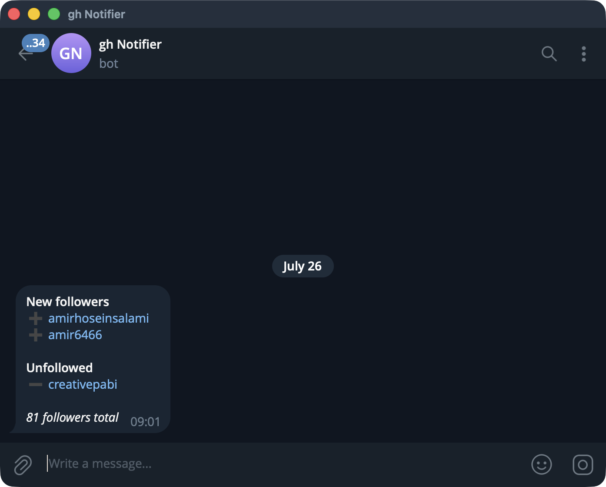

# gh-notifier-cf-worker

<p align="center">
  
</p>

Telegram alerts when someone **stars**, **forks**, **follows** or **unfollows** you on
GitHub. One Cloudflare Worker on a cron trigger. Free tier, no server, no database.

GitHub has no notification event for any of these. Its notification system is built
entirely around repository conversations, CI and mentions — `/notifications/settings`
doesn't even exist as an endpoint — so the only way to know is to poll and diff.

## How it works

One cron tick fetches your follower list and your repo list, diffs both against a
snapshot in Workers KV, and reports what changed.

```
cron ─▶ GET /users/{user}/followers ─┐
        GET /users/{user}/repos ─────┼─▶ diff vs KV ─▶ Telegram ─▶ commit new snapshot
                                     ┘
```

Two design decisions worth knowing, both learned the hard way:

**Stars and forks come from repo counts, not the events feed.** The obvious approach is
to walk `/users/{user}/received_events` for `WatchEvent` and `ForkEvent`. That feed is
capped at ~300 events and, on an account that follows a few active people, turns over 100
events in about six hours — a daily cron would miss almost everything. Diffing
`stargazers_count` and `forks_count` from `/users/{user}/repos` is one request, exact, and
has no retention window. Naming *who* costs one extra request, and only for repos whose
count actually moved.

**Delivery happens before the snapshot advances.** Commit-then-send means a failed send
silently consumes the events it failed to report. Send-then-commit means a failure costs
a duplicate message on the next tick instead. Losing a follower notification is worse than
seeing one twice.

## Setup

```bash
npm install
```

**1. Telegram bot.** Message [@BotFather](https://t.me/BotFather), `/newbot`, keep the
token. Send your new bot any message, then read your chat id:

```bash
curl -s "https://api.telegram.org/bot<BOT_TOKEN>/getUpdates" | jq '.result[0].message.chat.id'
```

**2. KV namespace.** Create it and paste the printed `id` into `wrangler.jsonc`:

```bash
npx wrangler kv namespace create FOLLOWERS
```

**3. Set `GITHUB_USER`** in `wrangler.jsonc` to your own username.

**4. Secrets.** Run each and paste at the prompt — the value is *not* a command argument:

```bash
npx wrangler secret put TELEGRAM_BOT_TOKEN
npx wrangler secret put TELEGRAM_CHAT_ID
npx wrangler secret put TRIGGER_SECRET
```

`TRIGGER_SECRET` is any random string; it guards the manual endpoint. Generate one with
`openssl rand -hex 16`.

**5. `GITHUB_TOKEN`** — technically optional, practically necessary. Every endpoint used
is public, but unauthenticated GitHub allows 60 requests/hour **per source IP**, and
Workers share egress IPs with other tenants who will exhaust it for you. This is not
hypothetical; it takes minutes to hit. A token raises you to 5,000/hour.

Create a fine-grained token at
[github.com/settings/personal-access-tokens/new](https://github.com/settings/personal-access-tokens/new)
with **Public Repositories (read-only)** and *no* account permissions — it reads exactly
what an anonymous visitor can:

```bash
npx wrangler secret put GITHUB_TOKEN
```

**6. Deploy and seed.** The first run stores a baseline silently; without it every existing
follower and star would arrive at once:

```bash
npx wrangler deploy
curl "https://<worker>.<subdomain>.workers.dev/run?key=<TRIGGER_SECRET>"
```

Secrets are read fresh on every invocation, so rotating one never needs a redeploy.

## Cost

One tick per day: 2 GitHub requests, 1 KV read, 1 KV write, plus one lookup per repo whose
counts moved.

| Resource | Free limit | Used |
|---|---|---|
| Cron Triggers | 5 per account | 1 |
| Worker requests | 100,000/day | ~1/day |
| KV reads | 100,000/day | 1/day |
| KV writes | 1,000/day | 1/day |
| KV storage | 1 GB | ~3 KB |

## Limits

- Only **net change between ticks** is visible. A follow and unfollow inside one window
  cancel out. Any polling design has this gap.
- Unstars are reported as a count, not a name — GitHub offers no way to see who left
  without storing every stargazer login.
- `/users/{user}/repos` covers repos you own. A token with `repo` scope would include
  private ones, but that is far more access than this needs.

## Operating it

`GET /run?key=<TRIGGER_SECRET>` triggers a run and returns the diff as JSON; anything else
returns 403 or 404. `npx wrangler tail` streams live logs. Cron failures report themselves
to Telegram rather than failing silently — though if the *bot token itself* is missing,
that report has no way out, so check `wrangler tail` when debugging a quiet Worker.

## Credit

A rewrite of the notification logic from
[andreausu/git-notifier](https://github.com/andreausu/git-notifier) (MIT, unmaintained
since 2019), which was multi-tenant SaaS: Sinatra, Redis, Sidekiq, Puma and nginx across
five Dockerfiles, with OAuth signup and HTML email digests. Single-user on Workers, that
collapses to one cron handler and one KV key.

Kept from the original: distinguishing an unfollow from a deleted account, since a 404 on
the user lookup means they're gone rather than that they left.

Fixed from the original: owned-repo matching used a substring test against `owner/name`,
which also fires on anyone else's repo whose *name* contains your username. This compares
the owner segment exactly.

## License

MIT, inheriting from git-notifier. See [LICENSE](LICENSE).
